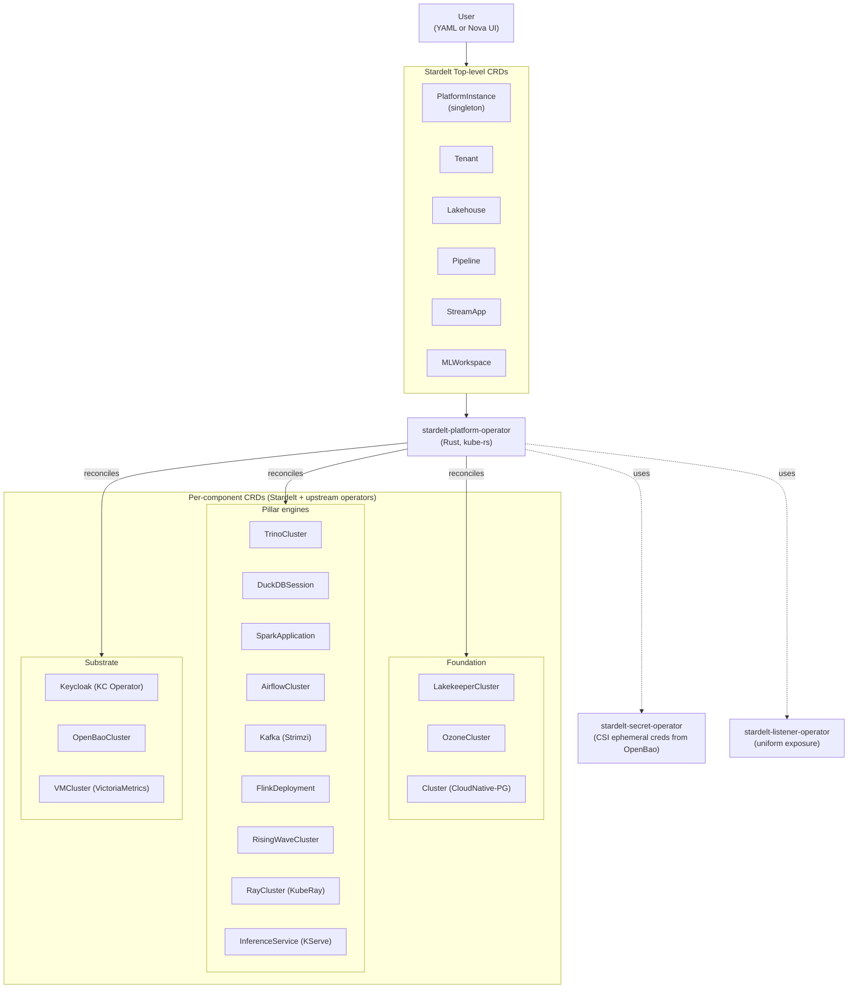

# Control-plane reconciliation

How Stardelt's top-level CRDs reconcile into per-component CRDs via the platform operator.

```mermaid
flowchart TB
  USER["User<br/>(YAML or Nova UI)"]

  subgraph STARDELT_CRDS["Stardelt Top-level CRDs"]
    PI["PlatformInstance<br/>(singleton)"]
    T["Tenant"]
    LH["Lakehouse"]
    P["Pipeline"]
    SA["StreamApp"]
    ML["MLWorkspace"]
  end

  OP["stardelt-platform-operator<br/>(Rust, kube-rs)"]

  subgraph COMPONENT_CRDS["Per-component CRDs (Stardelt + upstream operators)"]
    direction LR

    subgraph FOUND_CRDS["Foundation"]
      LK["LakekeeperCluster"]
      OZ["OzoneCluster"]
      PG["Cluster (CloudNative-PG)"]
    end

    subgraph PILLAR_CRDS["Pillar engines"]
      TR["TrinoCluster"]
      DD["DuckDBSession"]
      SP["SparkApplication"]
      AF["AirflowCluster"]
      K["Kafka (Strimzi)"]
      FL["FlinkDeployment"]
      RW["RisingWaveCluster"]
      RC["RayCluster (KubeRay)"]
      KS["InferenceService (KServe)"]
    end

    subgraph SUBSTRATE_CRDS["Substrate"]
      KC["Keycloak (KC Operator)"]
      OB["OpenBaoCluster"]
      VM["VMCluster (VictoriaMetrics)"]
    end
  end

  USER --> STARDELT_CRDS
  STARDELT_CRDS --> OP

  OP -- reconciles --> FOUND_CRDS
  OP -- reconciles --> PILLAR_CRDS
  OP -- reconciles --> SUBSTRATE_CRDS

  OP -. uses .-> SECRET["stardelt-secret-operator<br/>(CSI ephemeral creds from OpenBao)"]
  OP -. uses .-> LISTENER["stardelt-listener-operator<br/>(uniform exposure)"]
```
