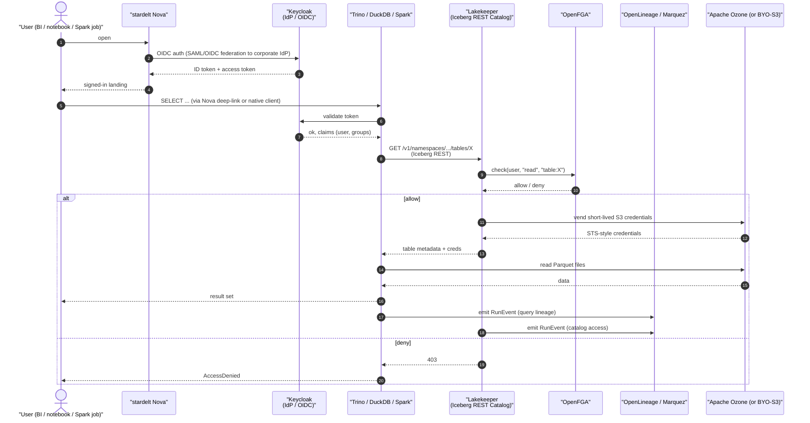

# Lakehouse read path

The canonical stardelt query flow — from Nova to Ozone, with OIDC, OpenFGA authorization, and OpenLineage emission.

```mermaid
sequenceDiagram
  autonumber
  actor User as "User (BI / notebook / Spark job)"
  participant Nova as "stardelt Nova"
  participant KC as "Keycloak<br/>(IdP / OIDC)"
  participant Engine as "Trino / DuckDB / Spark"
  participant LK as "Lakekeeper<br/>(Iceberg REST Catalog)"
  participant FGA as "OpenFGA"
  participant OL as "OpenLineage / Marquez"
  participant OZ as "Apache Ozone (or BYO-S3)"

  User->>Nova: open
  Nova->>KC: OIDC auth (SAML/OIDC federation to corporate IdP)
  KC-->>Nova: ID token + access token
  Nova-->>User: signed-in landing

  User->>Engine: SELECT ... (via Nova deep-link or native client)
  Engine->>KC: validate token
  KC-->>Engine: ok, claims (user, groups)

  Engine->>LK: GET /v1/namespaces/.../tables/X<br/>(Iceberg REST)
  LK->>FGA: check(user, "read", "table:X")
  FGA-->>LK: allow / deny
  alt allow
    LK->>OZ: vend short-lived S3 credentials
    OZ-->>LK: STS-style credentials
    LK-->>Engine: table metadata + creds
    Engine->>OZ: read Parquet files
    OZ-->>Engine: data
    Engine-->>User: result set
    Engine->>OL: emit RunEvent (query lineage)
    LK->>OL: emit RunEvent (catalog access)
  else deny
    LK-->>Engine: 403
    Engine-->>User: AccessDenied
  end
```
