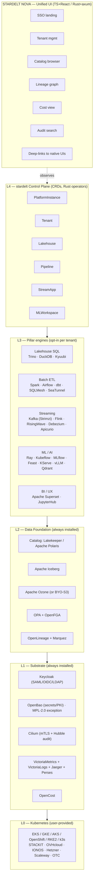

# Layered architecture

The four horizontal layers that make up stardelt, with Nova on top.

```mermaid
flowchart TB
  subgraph NOVA["STARDELT NOVA — Unified UI (TS+React / Rust+axum)"]
    NOVA_SSO["SSO landing"]
    NOVA_TENANT["Tenant mgmt"]
    NOVA_CATALOG["Catalog browser"]
    NOVA_LINEAGE["Lineage graph"]
    NOVA_COST["Cost view"]
    NOVA_AUDIT["Audit search"]
    NOVA_LINK["Deep-links to native UIs"]
  end

  subgraph L4["L4 — stardelt Control Plane (CRDs, Rust operators)"]
    CRD1["PlatformInstance"]
    CRD2["Tenant"]
    CRD3["Lakehouse"]
    CRD4["Pipeline"]
    CRD5["StreamApp"]
    CRD6["MLWorkspace"]
  end

  subgraph L3["L3 — Pillar engines (opt-in per tenant)"]
    P1["Lakehouse SQL<br/>Trino · DuckDB · Kyuubi"]
    P2["Batch ETL<br/>Spark · Airflow · dbt · SQLMesh · SeaTunnel"]
    P3["Streaming<br/>Kafka (Strimzi) · Flink · RisingWave · Debezium · Apicurio"]
    P4["ML / AI<br/>Ray · Kubeflow · MLflow · Feast · KServe · vLLM · Qdrant"]
    P5["BI / UX<br/>Apache Superset · JupyterHub"]
  end

  subgraph L2["L2 — Data Foundation (always installed)"]
    CAT["Catalog: Lakekeeper / Apache Polaris"]
    FMT["Apache Iceberg"]
    OBJ["Apache Ozone (or BYO-S3)"]
    POL["OPA + OpenFGA"]
    LIN["OpenLineage + Marquez"]
  end

  subgraph L1["L1 — Substrate (always installed)"]
    IDP["Keycloak (SAML/OIDC/LDAP)"]
    SEC["OpenBao (secrets/PKI) · MPL-2.0 exception"]
    NET["Cilium (mTLS + Hubble audit)"]
    OBS["VictoriaMetrics + VictoriaLogs + Jaeger + Perses"]
    COST["OpenCost"]
  end

  subgraph L0["L0 — Kubernetes (user-provided)"]
    K8S["EKS / GKE / AKS / OpenShift / RKE2 / k3s<br/>STACKIT · OVHcloud · IONOS · Hetzner · Scaleway · OTC"]
  end

  NOVA -.observes.-> L4
  L4 --> L3
  L3 --> L2
  L2 --> L1
  L1 --> L0
```
